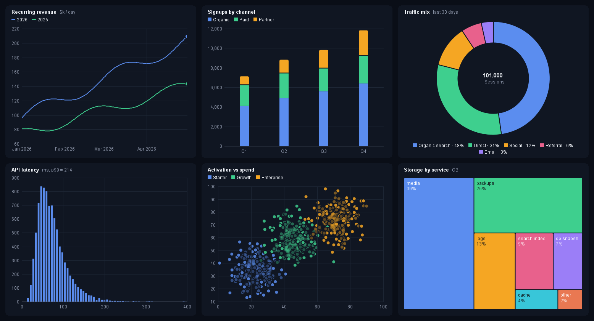
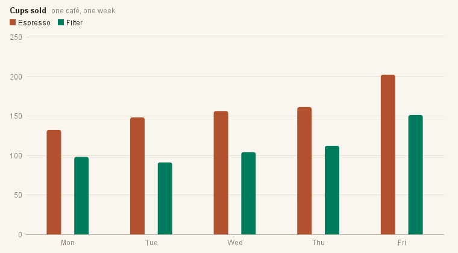
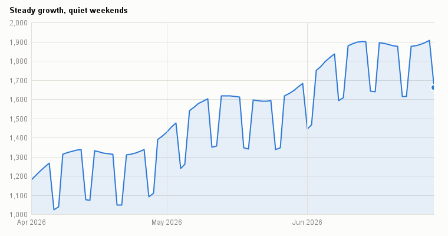
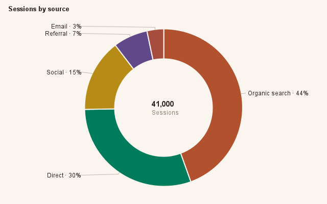
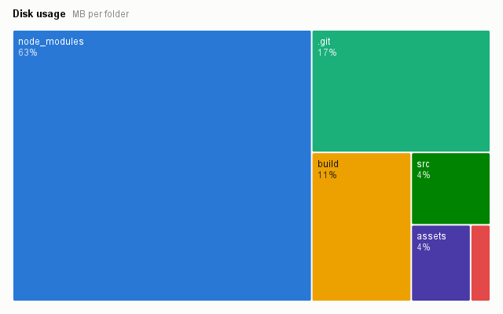
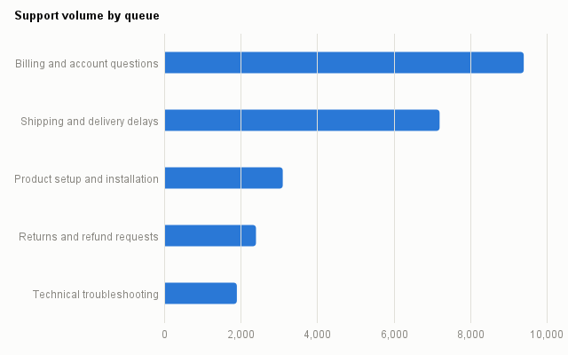
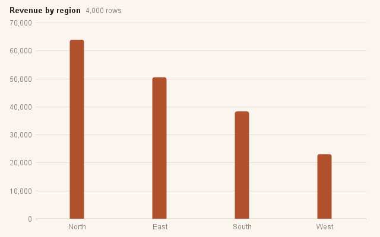
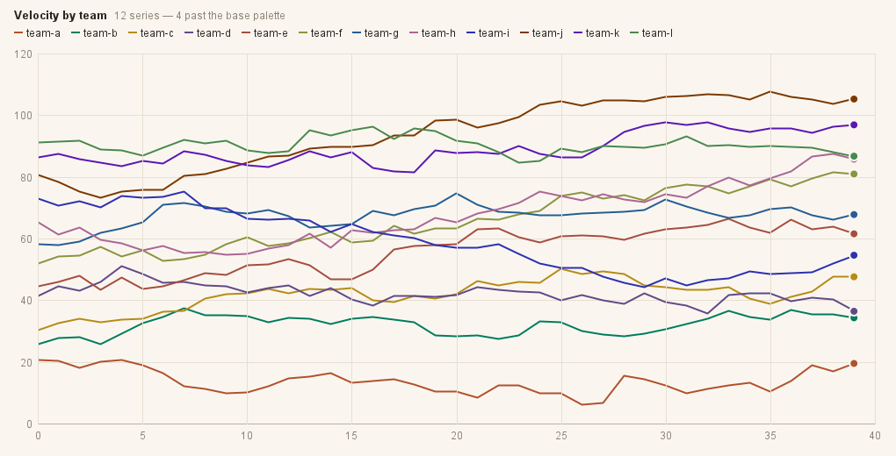

<p align="center">
  <picture>
    <source media="(prefers-color-scheme: dark)" srcset="docs/logo-dark.svg">
    
  </picture>
</p>

<p align="center">
A small, pretty charting library for Swing. Pure JDK — zero dependencies — with a one-line API,<br>
interactive charts by default, and a colourblind-aware palette validated for light and dark surfaces.
</p>



<sup>Six charts, one custom theme — composed headless by inkplot itself (`ShowcaseTest`), like every
image on this page: the code shown is exactly what rendered the chart next to it, regenerated on every
build so they can't drift apart.</sup>

## Quickstart

```java
import io.github.wesleym.inkplot.Charts;

panel.add(Charts.bar("Mon", "Tue", "Wed", "Thu", "Fri")
        .series("Espresso", 132, 148, 156, 161, 202)
        .series("Filter", 98, 91, 104, 112, 151)
        .title("Cups sold", "one café, one week")
        .component());
```



`component()` returns a live `JComponent`: hover tooltips, wheel zoom about the cursor, drag-to-pan, a
brush X-zoom on continuous axes, double-click to reset — all on by default. Swap `component()` for
`image(width, height)` to render headless (reports, tests, CI), like every image on this page.

## A value over time

X values are epoch milliseconds; `timeAxis()` gives the axis calendar ticks.

```java
long day = 24L * 60 * 60 * 1000;
long start = Instant.parse("2026-04-01T00:00:00Z").toEpochMilli();
double[] when = new double[90];
double[] users = new double[90];
for (int i = 0; i < 90; i++) {
    when[i] = start + i * day;
    users[i] = 1180 + i * 9 + (i % 7 >= 5 ? -260 : 0) + 70 * Math.sin(i / 5.0);
}
Charts.line().timeAxis()
        .series("Daily active users", when, users)
        .title("Steady growth, quiet weekends")
        .component();
```



## Shares of a whole

```java
Charts.doughnut(
        new String[] { "Organic search", "Direct", "Social", "Referral", "Email" },
        new double[] { 18200, 12400, 6100, 2900, 1400 }, "Sessions")
        .title("Sessions by source")
        .component();
```



The same shares draw as a `Charts.waffle(...)` unit grid or, for skewed magnitudes, a squarified treemap:

```java
Charts.treemap(
        new String[] { "node_modules", ".git", "build", "src", "assets", "docs" },
        new double[] { 482, 130, 88, 34, 27, 9 })
        .title("Disk usage", "MB per folder")
        .component();
```



## Distributions

Hand `histogram` raw values and it bins them (Freedman–Diaconis); `.logScale()` is there for when one
dominant bucket crushes the rest. `Charts.scatter(x, y)` and box plots cover the rest of the family.

```java
Random rng = new Random(7);
double[] responseMs = new double[8000];
for (int i = 0; i < responseMs.length; i++) {
    responseMs[i] = Math.exp(rng.nextGaussian() * 0.5 + 4.6);
}
Charts.histogram(responseMs)
        .title("Response time", "milliseconds, 8,000 requests")
        .component();
```


## Long labels read sideways

```java
Charts.bar("Billing and account questions", "Shipping and delivery delays",
                "Product setup and installation", "Returns and refund requests",
                "Technical troubleshooting")
        .series("Tickets", 9400, 7200, 3100, 2400, 1900)
        .horizontal()
        .title("Support volume by queue")
        .component();
```



## Stacked series

```java
Charts.bar("Q1", "Q2", "Q3", "Q4")
        .series("Solar", 41, 54, 66, 48)
        .series("Wind", 88, 72, 61, 94)
        .series("Hydro", 33, 36, 31, 35)
        .stacked()
        .legendBelow()
        .title("Generation mix", "GWh")
        .component();
```


## Table in, chart out

For query results, CSVs, or any table of strings, wrap the rows in a `ResultSnapshot`. inkplot classifies
the columns (declared types are hints; untyped columns are sniffed from their values, including messy
real-world timestamps), suggests the right form, and builds it:

```java
ResultSnapshot table = new ResultSnapshot(
        List.of("region", "amount"), List.of("varchar", "numeric"), rows, false);
Charts.auto(table).title("Revenue by region", "4,000 rows").component();
```



Or drive the pipeline explicitly with a `ChartSpec` — which columns are the axes, the aggregate
(count / sum / avg / min / max), an optional series split:

```java
ChartSpec spec = new ChartSpec.Bar(regionCol, amountCol, Aggregate.SUM, null, false);
Charts.of(table, spec).component();
```

The pipeline is honest about coverage by design: a truncated result, a point cap, or dropped non-numeric
cells surface as a quiet figure note on the chart — a partial picture is never presented as the whole.

## Interaction

<p>
  
  
</p>

- **Hover** — a snapping crosshair with an all-series read-out on line/density charts; a lifted mark plus
  tooltip everywhere else.
- **Zoom & pan** — mouse-wheel zoom about the cursor (0.25×–8×), drag to pan, crisp vector re-render at
  any magnification, double-click to reset.
- **Brush** — drag across a continuous or time X axis to zoom the data domain; axes re-derive.

Exports (`image`, or `ChartCanvas.renderTo` on any `Graphics2D`) always render the full 1:1 view, never
the transient screen viewport.

## Theming

`ChartTheme.LIGHT` and `ChartTheme.DARK` are validated defaults: the eight-hue categorical palette is
ordered for colourblind separation, and the dark palette is the same hues re-stepped for the dark
surface — not an automatic flip. Every colour a chart draws with lives in one immutable value, so a
whole visual identity is one expression — this is the "Midnight" theme the dashboard above uses:

```java
ChartTheme midnight = new ChartTheme(true,
        new Color(0x10, 0x16, 0x22),    // surface
        new Color(0xF2, 0xF5, 0xFA),    // text
        new Color(0x8A, 0x93, 0xA6),    // muted
        new Color(0x1D, 0x26, 0x35),    // hairline
        new Color(0x5B, 0x8D, 0xEF),    // accent
        new Color(0x1A, 0x23, 0x33),    // elevated (tooltips)
        List.of(new Color(0x5B, 0x8D, 0xEF), new Color(0x3E, 0xCF, 0x8E),
                new Color(0xF5, 0xA6, 0x23), new Color(0xE8, 0x61, 0x8C),
                new Color(0x9B, 0x7E, 0xF7), new Color(0x38, 0xC6, 0xD9),
                new Color(0xE9, 0x78, 0x52), new Color(0xC3, 0xD3, 0x4F)));

Charts.bar(cats, values).theme(midnight).component();
```

The same chart, four palettes — the two built-ins plus "Midnight" and a warm print-like "Paper":


Charts past the eighth series don't cycle the palette — extra slots generate distinct hues by
golden-angle rotation across shade tiers, contrast-checked against the theme surface, so even a
twelve-series spaghetti stays tellable-apart:



A host application with its own UI scale or font hands them over once, and every chart tracks them:

```java
ChartStyle.scaleWith(() -> appZoomFactor);   // e.g. a Ctrl +/- UI zoom
ChartStyle.fontWith(() -> appBaseFont);
```

## Chart types

Bar (grouped / stacked / horizontal), line (numeric or time axis), scatter, histogram, density,
box-and-whisker, doughnut, waffle, and treemap — plus a proportion strip for compact share bars.

## Requirements

Java 21+. No dependencies.

## Building

```
./gradlew test
```

The test suite includes a visual harness that renders every chart type in both themes to
`build/chart-*.png` — the render-and-look gate behind every change — plus `ReadmeExamplesTest` and
`ShowcaseTest`, which regenerate every image in this README from the exact code shown above.

## License

[MIT](LICENSE)
