<p align="center">
  <picture>
    <source media="(prefers-color-scheme: dark)" srcset="docs/logo-dark.svg">
    
  </picture>
</p>

<p align="center">
A small, pretty charting library for Swing. Pure JDK — zero dependencies — with a one-line API,<br>
interactive charts by default, and five vintage built-in themes, every palette machine-checked<br>
for colourblind separation.
</p>

<p align="center">
  
</p>

<sup>The charts inkplot draws — line, bar, doughnut, histogram, scatter, treemap — one after another, in
the built-in `ChartTheme.PAPER`. Every image on this page is a crisp SVG rendered by the library itself.</sup>

Or composed into a dashboard, all at once:

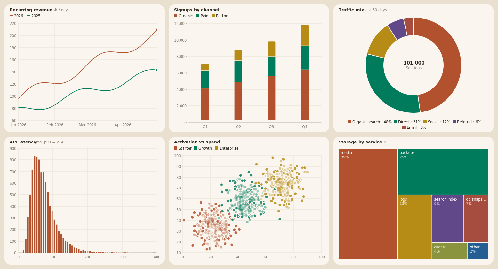

## Quickstart

```java
import io.github.wesleym.inkplot.Charts;

panel.add(Charts.bar("Mon", "Tue", "Wed", "Thu", "Fri")
        .series("Espresso", 132, 148, 156, 161, 202)
        .series("Filter", 98, 91, 104, 112, 151)
        .title("Cups sold", "one café, one week")
        .component());
```

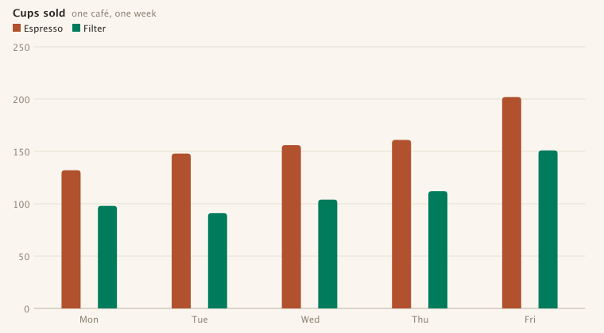

`component()` returns a live `JComponent`: an entry animation the first time it appears (bars grow up,
lines draw on, the doughnut sweeps in), hover tooltips, wheel zoom about the cursor, drag-to-pan, a
brush X-zoom on continuous axes, double-click to reset — all on by default. Swap `component()` for
`image(width, height)` (raster) or `toSvg(width, height)` (crisp vector) to render headless — reports,
tests, CI, or the images on this page.

## Run the samples

Five small windows to play with — each is a short, heavily-commented program under `samples/`:

```
./gradlew samples            # list them
./gradlew runTableTour       # start here
```

| Sample | What it teaches |
|---|---|
| `runHelloBars` | The ten-line starter: one chart in one window. |
| `runTableTour` | A real CSV through the named-column factories — one tab per question. |
| `runThemeGallery` | Live re-theming across the built-in family and a custom theme. |
| `runExplorerLite` | The interactive-host pattern: pickers + async pipeline + one long-lived canvas. |
| `runLiveDashboard` | Six live charts composed into one dashboard window. |
| `runStreamingFeed` | **Advanced** — a live feed: rolling table, superseding pipeline, re-rendering status strip. |
| `runInsightCards` | **Advanced** — embedded analytics cards driven by the power layer: `ChartColumns` picks each column's form, `ChartBuilder` executes it, provenance feeds a `ChartNotice`. |

Every window has the full interaction layer — hover, wheel zoom, drag-pan, brush, double-click reset —
and the samples compile as part of `check`, so they can't rot.

## A value over time

X values are epoch milliseconds; `timeAxis()` gives the axis calendar ticks.

```java
long day = 24L * 60 * 60 * 1000;
long start = Instant.parse("2026-04-01T00:00:00Z").toEpochMilli();
double[] when = new double[90];
double[] users = new double[90];
for (int i = 0; i < 90; i++) {
    when[i] = start + i * day;
    users[i] = 1180 + i * 9 + (i % 7 >= 5 ? -260 : 0) + 70 * Math.sin(i / 5.0);
}
Charts.line().timeAxis()
        .series("Daily active users", when, users)
        .title("Steady growth, quiet weekends")
        .component();
```

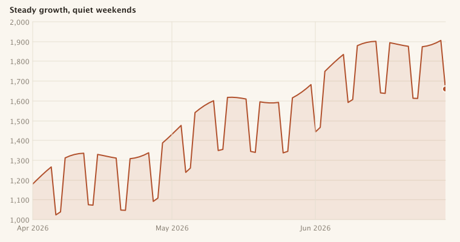

## Shares of a whole

```java
Charts.doughnut(
        new String[] { "Organic search", "Direct", "Social", "Referral", "Email" },
        new double[] { 18200, 12400, 6100, 2900, 1400 }, "Sessions")
        .title("Sessions by source")
        .component();
```


The same shares draw as a `Charts.waffle(...)` unit grid or, for skewed magnitudes, a squarified treemap:

```java
Charts.treemap(
        new String[] { "node_modules", ".git", "build", "src", "assets", "docs" },
        new double[] { 482, 130, 88, 34, 27, 9 })
        .title("Disk usage", "MB per folder")
        .component();
```

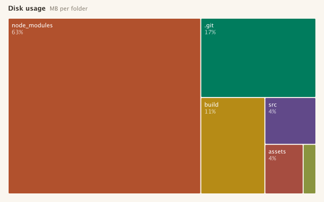

## Distributions

Hand `histogram` raw values and it bins them (Freedman–Diaconis); `.logScale()` is there for when one
dominant bucket crushes the rest. `Charts.scatter(x, y)` and box plots cover the rest of the family.

```java
Random rng = new Random(7);
double[] responseMs = new double[8000];
for (int i = 0; i < responseMs.length; i++) {
    responseMs[i] = Math.exp(rng.nextGaussian() * 0.5 + 4.6);
}
Charts.histogram(responseMs)
        .title("Response time", "milliseconds, 8,000 requests")
        .component();
```

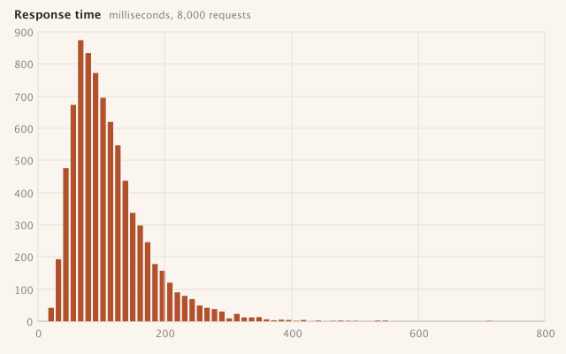

## Long labels read sideways

```java
Charts.bar("Billing and account questions", "Shipping and delivery delays",
                "Product setup and installation", "Returns and refund requests",
                "Technical troubleshooting")
        .series("Tickets", 9400, 7200, 3100, 2400, 1900)
        .horizontal()
        .title("Support volume by queue")
        .component();
```

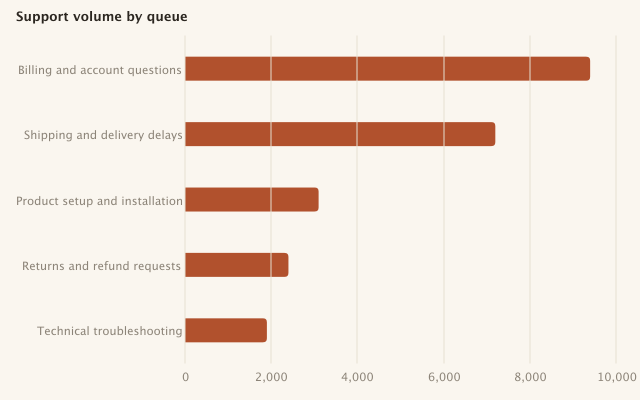

## Stacked series

```java
Charts.bar("Q1", "Q2", "Q3", "Q4")
        .series("Solar", 41, 54, 66, 48)
        .series("Wind", 88, 72, 61, 94)
        .series("Hydro", 33, 36, 31, 35)
        .stacked()
        .legendBelow()
        .title("Generation mix", "GWh")
        .component();
```

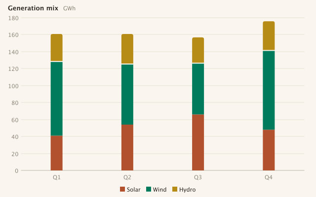

## Table in, chart out

For query results, CSVs, or any table of strings: wrap the rows in a `Table` and address columns **by
name**, the way a data-analysis library would. Values are interpreted per chart — numbers, timestamps
(including messy real-world ones), and categories are sniffed as needed:

```java
Table table = Table.of(List.of("region", "amount"), rows);
Charts.bar(table, "region", "amount").title("Revenue by region", "4,000 rows").component();
```


One factory per question — `bar`, `line`, `scatter`, `histogram`, `density`, `doughnut`, `treemap`,
`waffle`, `box` — with refinements where the form wants them, and `Charts.auto(table)` when you'd
rather inkplot picked:

```java
Charts.bar(table, "quarter", "signups").by("channel").stacked();   // split + stack by a column
Charts.line(table, "created", "amount").by("region");              // one line per region
Charts.scatter(table, "spend", "activation").by("plan");           // coloured cohorts
```

A typo'd column name fails fast with the table's real names — never a blank chart. And the pipeline is
honest about coverage by design: a truncated result, a point cap, or dropped non-numeric cells surface
as a quiet figure note on the chart. The full tour — specs, column classification, provenance — is in
the [charting tables guide](docs/charting-tables.md).

## Interaction

<p>
  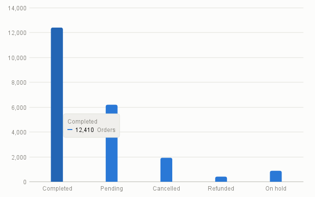
  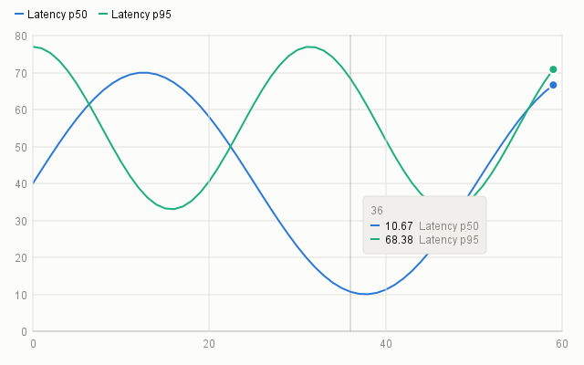
</p>

- **Hover** — a snapping crosshair with an all-series read-out on line/density charts; a lifted mark plus
  tooltip everywhere else.
- **Zoom & pan** — mouse-wheel zoom about the cursor (0.25×–8×), drag to pan, crisp vector re-render at
  any magnification, double-click to reset.
- **Brush** — drag across a continuous or time X axis to zoom the data domain; axes re-derive.

Exports (`image` for raster, `toSvg` for vector, or `ChartCanvas.renderTo` on any `Graphics2D`) always
render the full 1:1 view, never the transient screen viewport. The SVG is true vector (crisp at any size,
text outlined so it needs no fonts) — pure JDK, no dependency.

## Theming

Five vintage-leaning themes are built in, one call away:

- **`ChartTheme.PAPER`** — the default: warm paper, earthy inks (the dashboard above).
- **`ChartTheme.GAZETTE`** — newsprint: a cool sheet, masthead red, the restrained inks of a broadsheet.
- **`ChartTheme.ATLAS`** — an old map: aged chart-paper tan and hand-coloured cartographer's inks.
- **`ChartTheme.INKWELL`** — Paper's dark companion: the near-black of dried ink, lit by ember.
- **`ChartTheme.NOCTURNE`** — a study after dark: deep viridian and brass-lamp light.

```java
Charts.bar(cats, values).theme(ChartTheme.NOCTURNE).component();
```

None of it is eyeballed: every built-in palette is machine-checked — OKLCH lightness band and chroma
floor, plus adjacent-slot colour-vision-deficiency separation under protan/deutan simulation — by
`ChartThemePaletteTest` on every build.

Every colour a chart draws with lives in one immutable value, so a whole visual identity of your own is
a single expression — a deep blue-black "Midnight", say:

```java
ChartTheme midnight = new ChartTheme(true,
        new Color(0x10, 0x16, 0x22),    // surface
        new Color(0xF2, 0xF5, 0xFA),    // text
        new Color(0x8A, 0x93, 0xA6),    // muted
        new Color(0x1D, 0x26, 0x35),    // hairline
        new Color(0x5B, 0x8D, 0xEF),    // accent
        new Color(0x1A, 0x23, 0x33),    // elevated (tooltips)
        List.of(new Color(0x5B, 0x8D, 0xEF), new Color(0x3E, 0xCF, 0x8E),
                new Color(0xF5, 0xA6, 0x23), new Color(0xE8, 0x61, 0x8C),
                new Color(0x9B, 0x7E, 0xF7), new Color(0x38, 0xC6, 0xD9),
                new Color(0xE9, 0x78, 0x52), new Color(0xC3, 0xD3, 0x4F)));

Charts.bar(cats, values).theme(midnight).component();
```

The same chart across the family — the five built-ins plus that custom "Midnight":

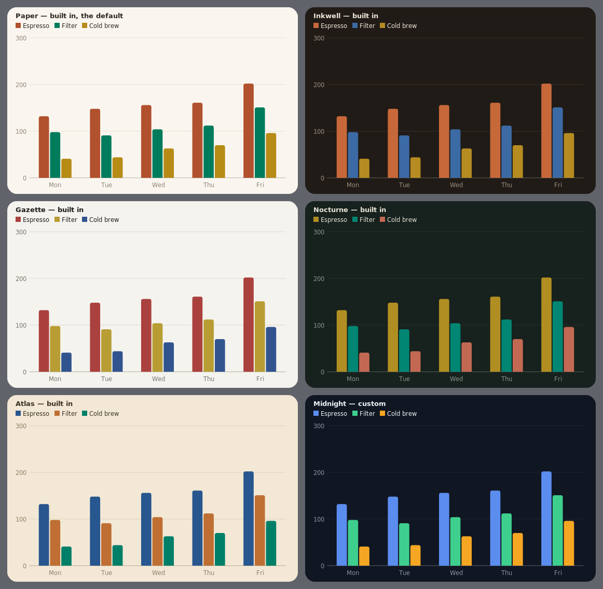

Charts past the eighth series don't cycle the palette — extra slots generate distinct hues by
golden-angle rotation across shade tiers, contrast-checked against the theme surface, so even a
twelve-series spaghetti stays tellable-apart:

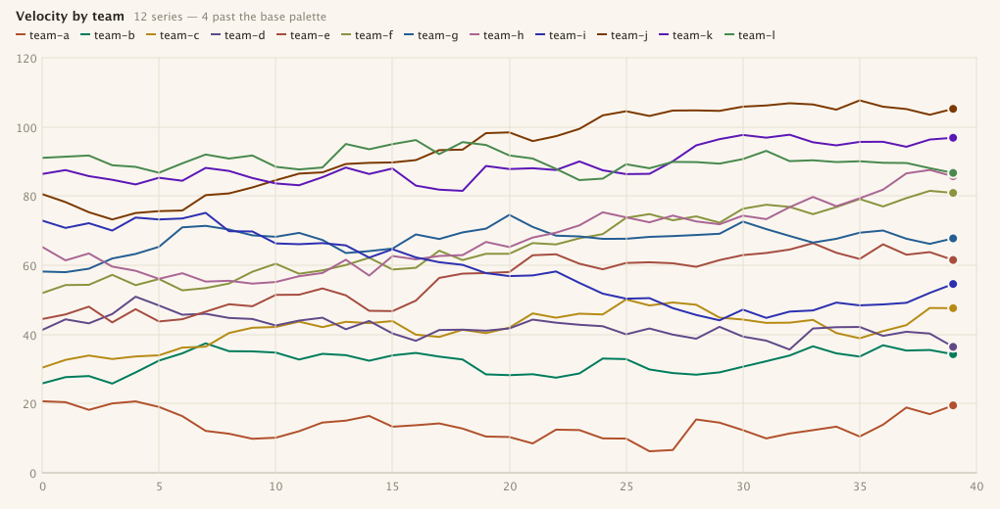

A host application with its own UI scale or font hands them over once, and every chart tracks them:

```java
ChartStyle.scaleWith(() -> appZoomFactor);   // e.g. a Ctrl +/- UI zoom
ChartStyle.fontWith(() -> appBaseFont);
```

## Chart types

Bar (grouped / stacked / horizontal), line (numeric or time axis), scatter, histogram, density,
box-and-whisker, doughnut, waffle, and treemap — plus a proportion strip for compact share bars.

## Building an interactive host

When you're building a chart *view* — pickers, live re-queries, a chart that stays on screen and
reconfigures — hold the widget and feed it through the async pipeline:

```java
ChartCanvas canvas = new ChartCanvas(ChartTheme.PAPER);      // lives as long as the view
ChartDataPipeline pipeline = new ChartDataPipeline();        // off-EDT prep, EDT delivery

pipeline.prepare(spec, table, canvas.getWidth(),             // on every picker change
        canvas::setData,
        statusBar::setText);
```

Superseded builds are dropped automatically — mash the pickers and only the latest chart lands. The
canvas's full stateful API (data swaps, log toggle, live re-theming, zoom controls, exports) is covered
in the [interactive hosts guide](docs/interactive-hosts.md); the snippet runs as `HostExampleTest`.

## Guides

- **[Charting tables](docs/charting-tables.md)** — the data-analyst path: `Table.of`, columns by name,
  refinements, specs, column classification, provenance.
- **[Theming](docs/theming.md)** — the built-in family, designing your own theme (and keeping it
  colourblind-safe), host style hooks.
- **[Interactive hosts](docs/interactive-hosts.md)** — the long-lived canvas, the async pipeline,
  interaction behaviours, exporting.

## The public surface at a glance

What you may depend on is stated as a Java module, not a convention — `module-info` exports these three
packages and nothing else:

| Class | What it's for |
|---|---|
| `Charts` | The factories: one call per chart type, over plain values or a `Table` with columns by name. |
| `Chart` / `BarChart` / `LineChart` | Fluent configuration ending in `component()`, `image(w, h)`, or `toSvg(w, h)`. |
| `TableBarChart` / `TableLineChart` / `TableScatterChart` | Table charts refining fluently: `by(column)`, `stacked()`, `points()`. |
| `ChartCanvas` | The live Swing widget; the stateful API interactive hosts hold on to. |
| `ChartTheme` | Every colour as one immutable value; five validated built-ins. |
| `ChartStyle` | Spacing/type tokens; plug in a host UI zoom and base font once. |
| `ChartFormat` | The numeric label rules charts use — for hosts matching their captions. |
| `ChartNotice` | A quiet coverage caption ("showing 20,000 of 480,000 rows") fed by `Provenance`. |
| `ProportionStrip` | A compact labelled share bar for tables and cards. |
| `Table` | The tabular seam: `Table.of(columns, rows)`, columns resolvable by name. |
| `ChartColumns` | Classifies columns into chart roles, sniffing values when types are missing. |
| `ChartAuto` | Suggests the right chart form for a table's shape. |
| `ChartBuilder` | Executes a spec over a table into `ChartData` (the pipeline calls it for you). |
| `ChartDataPipeline` | Async, EDT-safe, superseding chart preparation for interactive hosts. |
| `ChartData` | The prepared, ready-to-draw form — one immutable record per chart type. |
| `Provenance` | What the chart does and doesn't cover; drives the honesty notices. |
| `ChartSpec` + `ChartType`, `Aggregate`, `CategoryOrder` | The declarative "which columns, which roles, which reduction". |
| `ChartSpecs` | Sensible default specs — the engine behind `Charts.auto`. |

Each of these carries full Javadoc, and the three exported packages have `package-info` overviews that
orient a first read. The `render` and `scale` packages are implementation — **not exported**, free to
change between versions. If the public surface can't do something you need, that's an API gap to raise,
not a reason to reach inside.

## Requirements

Java 21+. No dependencies.

## Building

```
./gradlew test
```

The test suite includes a visual harness that renders every chart type in both themes to
`build/chart-*.png` — the render-and-look gate behind every change — plus `ReadmeExamplesTest` and
`ShowcaseTest`, which regenerate every image in this README from the exact code shown above.

## License

[MIT](LICENSE)
