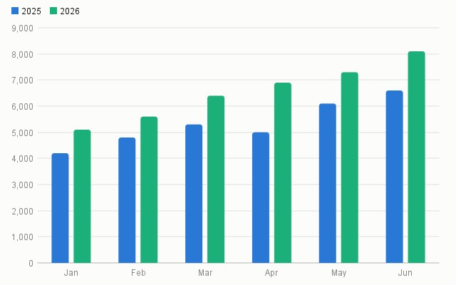
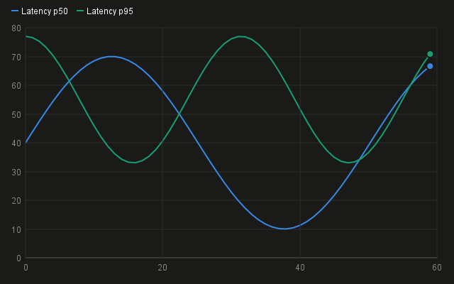
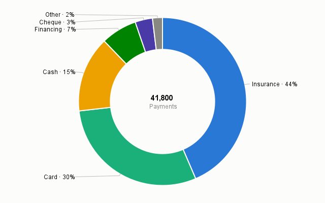
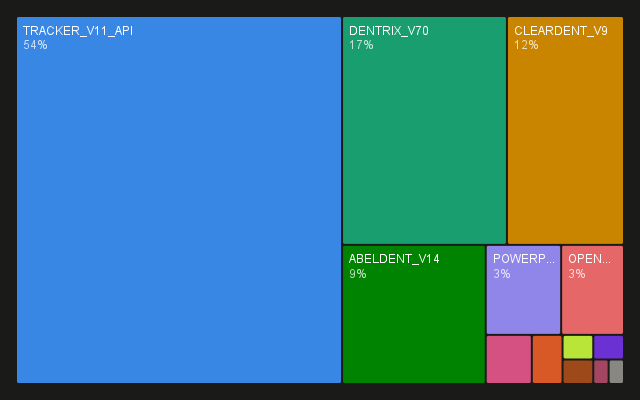
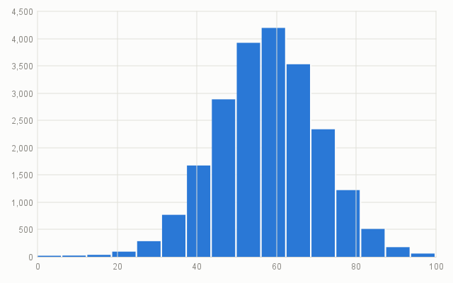
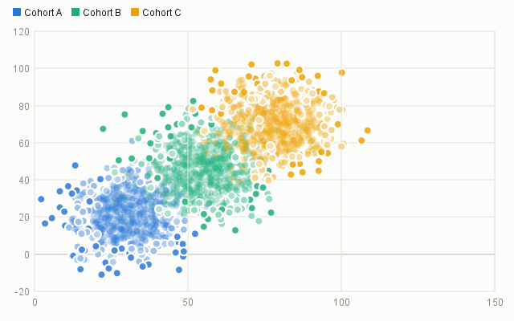
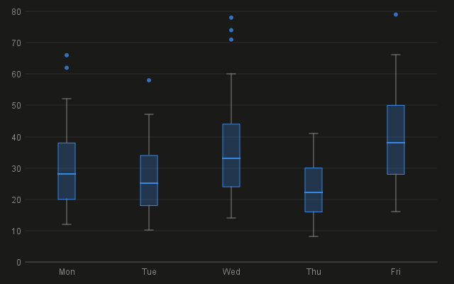
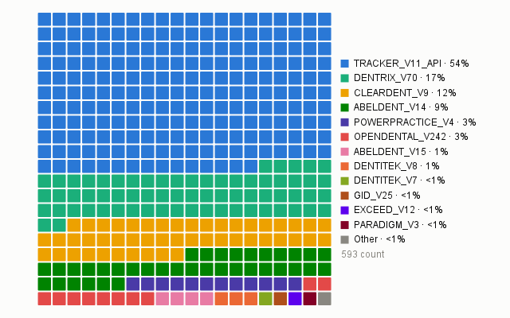
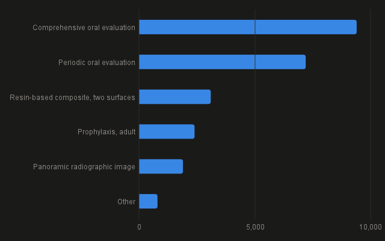

# inkplot

A small, pretty charting library for Swing. Pure JDK — no dependencies — with a one-line API,
interactive charts by default, and a colourblind-aware palette validated for both light and dark surfaces.

<p align="center">
  
  
</p>

```java
import io.github.wesleym.inkplot.Charts;

panel.add(Charts.bar("Jan", "Feb", "Mar", "Apr")
        .series("2025", 4.2, 4.8, 5.3, 5.0)
        .series("2026", 5.1, 5.6, 6.4, 6.9)
        .title("Bookings by month")
        .component());
```

That's a live widget: hover tooltips, wheel zoom about the cursor, drag-to-pan, a brush X-zoom on
continuous axes, and double-click to reset — all on by default.

## Why

Most Java charting libraries are heavyweight, dated by default, or both. inkplot is the opposite bet:
a compact Graphics2D core that looks designed out of the box, embeds in any Swing surface as an ordinary
`JComponent`, and renders headless for reports and tests. It grew inside a production database console and
was extracted whole — the polish came from daily use, not a demo gallery.

## Chart types

Bar (grouped / stacked / horizontal), line (numeric or time axis), scatter, histogram, density,
box-and-whisker, doughnut, waffle, and treemap — plus a proportion strip for compact share bars.

<p align="center">
  
  
  
</p>
<p align="center">
  
  
  
</p>

## Quickstart

Every chart starts at the `Charts` factory, configures fluently, and ends in `component()` (a Swing
widget) or `image(w, h)` (a `BufferedImage`, no display needed):

```java
// One-liners for plain values
Charts.histogram(latencies).title("Latency distribution").component();
Charts.doughnut(new String[] { "Cash", "Card", "Insurance" }, new double[] { 12, 55, 33 }).component();
Charts.line(xs, ys).logScale().component();

// Multi-series builders
Charts.bar("North", "South", "East", "West")
        .series("Q1", 10, 14, 9, 16)
        .series("Q2", 12, 15, 11, 18)
        .stacked()
        .legendBelow()
        .component();

// Headless render — reports, tests, CI
BufferedImage png = Charts.treemap(names, sizes).theme(ChartTheme.DARK).image(1280, 720);
```

### Tabular data in, chart out

For query results, CSVs, or any table of strings, wrap the rows in a `ResultSnapshot` and let inkplot
classify the columns (declared types are hints; untyped columns are sniffed from values, including
messy real-world timestamps) and pick the right form:

```java
ResultSnapshot table = new ResultSnapshot(columnNames, columnTypes, rows, false);
panel.add(Charts.auto(table).title("Revenue", "48,213 rows").component());
```

Or drive the pipeline explicitly with a `ChartSpec` — which columns are the axes, the aggregate
(count / sum / avg / min / max), an optional series split:

```java
ChartSpec spec = new ChartSpec.Bar(regionCol, amountCol, Aggregate.SUM, null, false);
panel.add(Charts.of(table, spec).component());
```

The pipeline is honest about coverage by design: a truncated result, a point cap, or dropped
non-numeric cells surface as a quiet figure note on the chart — a partial picture is never presented
as the whole.

## Theming

`ChartTheme.LIGHT` and `ChartTheme.DARK` are validated defaults: the eight-hue categorical palette is
ordered for colourblind separation, and the dark palette is the same hues re-stepped for the dark
surface — not an automatic flip. Every colour a chart draws with lives in one immutable value:

```java
ChartTheme brand = new ChartTheme(false, surface, text, muted, hairline, accent, elevated,
        List.of(/* your categorical palette, in fixed slot order */));
Charts.bar(cats, values).theme(brand).component();
```

Charts past the eighth series don't cycle the palette — extra slots generate distinct hues by
golden-angle rotation across shade tiers, contrast-checked against the theme surface.

A host application with its own UI scale or font hands them over once, and every chart tracks them:

```java
ChartStyle.scaleWith(() -> appZoomFactor);   // e.g. a Ctrl +/- UI zoom
ChartStyle.fontWith(() -> appBaseFont);
```

## Interaction

<p align="center">
  
  
</p>

- **Hover** — a snapping crosshair with an all-series read-out on line/density charts; a lifted mark
  plus tooltip everywhere else.
- **Zoom & pan** — mouse-wheel zoom about the cursor (0.25×–8×), drag to pan, crisp vector re-render
  at any magnification, double-click to reset.
- **Brush** — drag across a continuous or time X axis to zoom the data domain; axes re-derive.
- **Log scale** — for distributions where one dominant bucket crushes the rest.

Exports (`image`, or `ChartCanvas.renderTo` on any `Graphics2D`) always render the full 1:1 view,
never the transient screen viewport.

## Requirements

Java 21+. No dependencies.

## Building

```
./gradlew test
```

The test suite includes a visual harness that renders every chart type in both themes to
`build/chart-*.png` — the render-and-look gate behind every change.

## License

[MIT](LICENSE)
