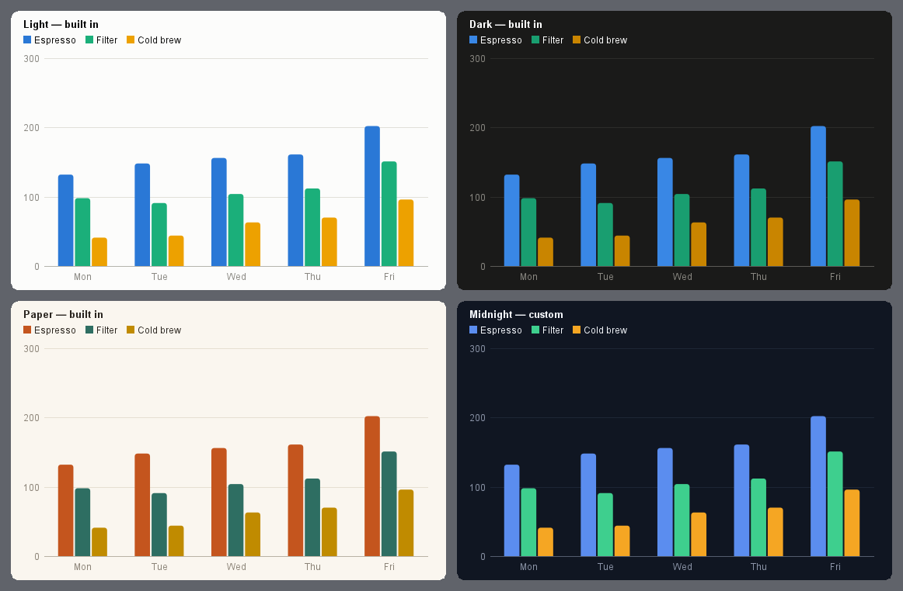

# Theming

Every colour a chart draws with lives in one immutable `ChartTheme`. Pass it per chart
(`.theme(...)`), or per canvas (`new ChartCanvas(theme)` / `restyle(theme)`), and the entire visual
identity follows — surface, inks, gridlines, tooltips, and the categorical palette.

## The built-in family



| Theme | Character |
|---|---|
| `ChartTheme.PAPER` | The default: warm paper, earthy inks — quiet, print-like. |
| `ChartTheme.GAZETTE` | Newsprint: cool sheet, masthead red, broadsheet restraint. |
| `ChartTheme.ATLAS` | An old map: aged tan, cartographer's navy, hand-coloured inks. |
| `ChartTheme.INKWELL` | Paper's dark companion: dried-ink near-black, lit by ember. |
| `ChartTheme.NOCTURNE` | A study after dark: deep viridian, brass-lamp light. |

```java
Charts.bar(table, "region", "amount").theme(ChartTheme.NOCTURNE).component();
```

None of it is eyeballed: every built-in palette is machine-checked — OKLCH lightness band, chroma
floor, and adjacent-slot colour-vision-deficiency separation under protan/deutan simulation
(`ChartThemePaletteTest` runs on every build). The palettes were designed in OKLCH space against those
checks; all five clear the ΔE 12 separation target.

## Your own theme

A theme is one expression — eight fields, no registry, no XML:

```java
ChartTheme midnight = new ChartTheme(true,          // sits on a dark surface
        new Color(0x10, 0x16, 0x22),    // surface
        new Color(0xF2, 0xF5, 0xFA),    // text
        new Color(0x8A, 0x93, 0xA6),    // muted (axis labels, legends)
        new Color(0x1D, 0x26, 0x35),    // hairline (gridlines)
        new Color(0x5B, 0x8D, 0xEF),    // accent (brush, highlights)
        new Color(0x1A, 0x23, 0x33),    // elevated (tooltips)
        List.of(/* eight series colours, in fixed slot order */));
```

The slot **order** matters: adjacent slots should stay distinguishable under colour-vision deficiency —
alternate lightness and warm/cool, and when a red-family hue neighbours a green-family one, make the
green the lighter of the two. Charts past the eighth series never cycle: extra slots generate distinct
hues by golden-angle rotation across shade tiers, contrast-checked against your surface.

Two accessors exist for hosts drawing their own furniture next to charts:
`theme.distribution()` (the single-hue fill histograms use — for compact strips) and
`ChartTheme.readableOn(fill)` (black or white, whichever reads on a filled mark).

## Tracking a host application

If your app has a UI zoom or its own base font, hand them over once at startup; every chart dimension
and label tracks them from then on:

```java
ChartStyle.scaleWith(() -> appZoomFactor);   // e.g. a Ctrl +/- zoom, 1.0 = 100%
ChartStyle.fontWith(() -> appBaseFont);
```

---

*Play with it: `gradlew runThemeGallery` switches every theme live on one chart.*

*Next: [Charting tables](charting-tables.md) · [Interactive hosts](interactive-hosts.md) · [README](../README.md)*
